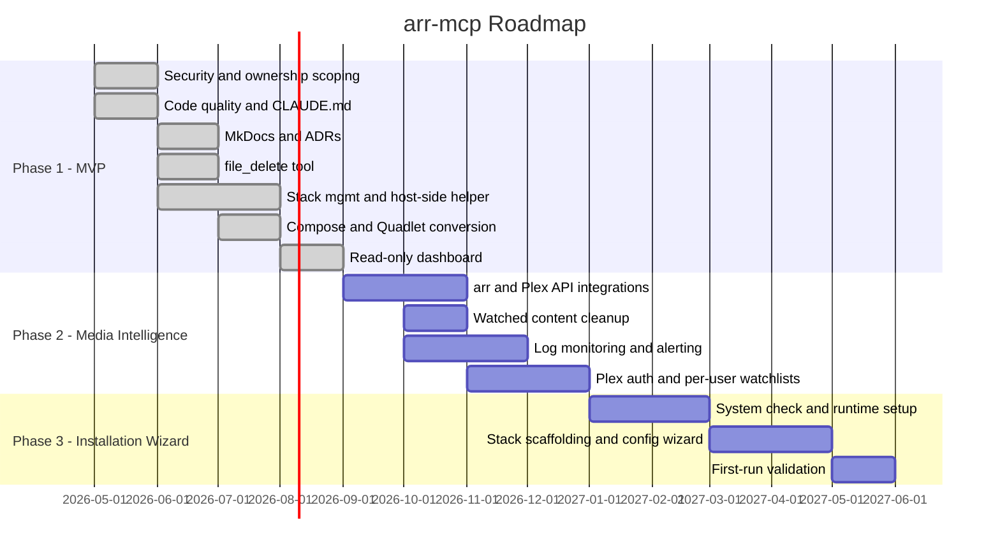

# Roadmap

## Overview

arr-mcp is built in three phases, each with a clear architectural goal, defined success criteria, and a verification step before moving forward. The phases are intentionally sequential — Phase 2 should not begin until Phase 1 is verified complete.

---

## Visual Timeline

---

## Phase 1 — MVP

### Architectural goal
Build a solid, secure, well-tested foundation that a technical user can deploy today with confidence. Every tool should work correctly, every operation should be safe, and the codebase should be maintainable by anyone picking it up cold.

### What this phase delivers

| Area | Goal |
|---|---|
| **Tools** | All MCP tools functional and tested — containers, stacks, filesystem, logs |
| **Security** | Filesystem operations scoped to owned resources; no privilege escalation possible |
| **Stack management** | Works correctly when arr-mcp runs inside a container (host-side helper) |
| **Migration** | Compose ↔ Quadlet conversion so users can move between Docker and Podman |
| **Frontend** | Read-only dashboard showing container status, disk usage, and stack health |
| **Documentation** | MkDocs site live, ADRs written, CLAUDE.md complete |
| **Quality** | CI passing — ruff, mypy, pytest — on every PR |

### Guardrails
- No Phase 2 API integrations (Plex, Sonarr, Radarr, SABnzbd APIs) until Phase 1 is verified complete
- No user authentication features until the dashboard baseline exists
- No installation wizard work until the tools it would install are stable

### Verification checklist
Before declaring Phase 1 complete, confirm:

- [ ] All MCP tools return correct results against a live stack
- [ ] `file_read` / `file_write` reject root-owned paths via `_check_path`
- [ ] `stack_list` and `directory_list` do not expose root-owned directories
- [ ] Stack restart/up/down works via the host-side helper
- [ ] Dashboard loads, auto-refreshes, and shows accurate container status
- [ ] MkDocs site is live on GitHub Pages
- [ ] All tests pass in CI with no skips related to unimplemented features
- [ ] No open `phase-1` security issues

---

## Phase 2 — Media Intelligence

### Architectural goal
Integrate with the APIs of the media stack applications (Plex, Sonarr, Radarr, SABnzbd) to enable cross-application intelligence that no single app provides — watched content cleanup, storage optimisation, health monitoring, and multi-user protection.

### What this phase delivers

| Area | Goal |
|---|---|
| **API integrations** | Read access to Plex, Sonarr, Radarr, SABnzbd APIs |
| **Watched cleanup** | Identify and safely delete fully-watched seasons, with per-user protection |
| **Log monitoring** | Scheduled error detection across all applications with alerting |
| **Multi-user** | Plex authentication on the dashboard; per-user watchlists; deletion protection |
| **Storage** | Surface large, duplicate, and unwatched content for review |

### Guardrails
- API credentials for Plex/Sonarr/Radarr/SABnzbd must be stored securely — never in compose files or quadlets
- Deletion operations must always require explicit confirmation and check all user watchlists first
- Jellyfin support is future state — design the auth layer to be provider-agnostic but don't implement it in this phase
- No installation wizard work in this phase

### Verification checklist
Before declaring Phase 2 complete, confirm:

- [ ] Plex watch history is readable and correctly cross-referenced with Sonarr library
- [ ] Watched season cleanup presents correct results and does not delete protected content
- [ ] Log monitoring correctly detects and surfaces errors from all applications
- [ ] Dashboard requires Plex login and shows per-user watchlist state
- [ ] Deletion of watchlisted content is blocked with a clear user-facing message
- [ ] All Phase 1 verification criteria still pass (no regression)

---

## Phase 3 — Installation Wizard

### Architectural goal
Make arr-mcp self-bootstrapping — a non-technical user should be able to go from a fresh Debian/Ubuntu machine to a fully running media server stack by following the guided wizard, with no manual configuration required.

### What this phase delivers

| Area | Goal |
|---|---|
| **System check** | Verify OS, runtime availability, disk space, network before starting |
| **Runtime setup** | Configure rootless Podman, socket activation, and systemd lingering |
| **Stack scaffolding** | Generate quadlet files or compose file for chosen services |
| **Directory structure** | Create and permission the `/media-server/` layout |
| **Configuration** | Walk through API key setup, download client, and indexer configuration |
| **Validation** | Verify all services are healthy and correctly connected at the end |

### Guardrails
- Every wizard step must be non-destructive and reversible where possible
- Partial installs must be detectable and resumable — no silent failures
- Jellyfin must be supported as an alternative to Plex from the start of this phase
- The wizard must work through the dashboard UI, not just chat

### Verification checklist
Before declaring Phase 3 complete, confirm:

- [ ] A fresh Debian/Ubuntu VM can complete the wizard from start to finish without manual intervention
- [ ] A partial install can be detected and resumed correctly
- [ ] All services pass health checks at the end of the wizard
- [ ] Jellyfin path is available as an alternative to Plex
- [ ] All Phase 1 and Phase 2 verification criteria still pass (no regression)

---

## Project alignment reviews

At the end of each phase, before beginning the next, conduct a structured review:

1. **Did we deliver what we said we would?** — Walk through the verification checklist item by item
2. **Did we introduce any technical debt?** — Identify anything that was deferred and create issues
3. **Are the ADRs still accurate?** — Update any that have been superseded by decisions made during the phase
4. **Has the goal shifted?** — If the project's purpose or target audience has changed, update this roadmap and CLAUDE.md before proceeding
5. **Is the codebase in a state we're proud of?** — Run the full test suite, check coverage, review open security issues
